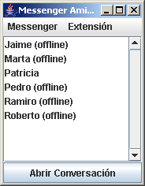
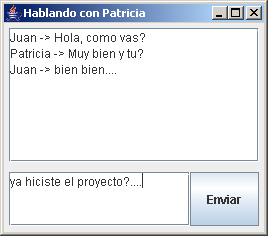
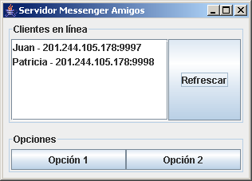

# Enunciado

El objetivo de estas aplicaciones es construir un sistema de mensajería al estilo del MSN Messenger, 
Yahoo Messenger o AIM. Para esto será necesario construir una aplicación que funcione como servidor y 
un cliente: los usuarios de la aplicación usarán el cliente para conectarse al servidor y este les informará 
sobre el estado de sus amigos (están conectados o desconectados).

Cada una de los usuarios de la aplicación tiene un nombre con el que se identifica en el sistema y puede 
construir una lista de amigos. Mientras esté utilizando el sistema, recibirá notificaciones cuando sus 
amigos se conecten o desconecten. El hecho de que un usuario tenga dentro de su lista de amigos a otro 
usuario no implica que al revés también sea cierto.

Dos amigos que estén conectados pueden establecer una conversación entre ellos. No es posible 
establecer conversaciones entre tres personas, pero si se pueden tener varias conversaciones al mismo 
tiempo.

Finalmente, es importante mencionar que la información sobre los usuarios y sus amigos se almacena en 
una base de datos relacional (Derby), a la que se tiene acceso desde la aplicación del servidor. 

# Interfaz

	Ventana Principal del Cliente

	Ventana de conversación del cliente

	Ventana Principal del Servidor
